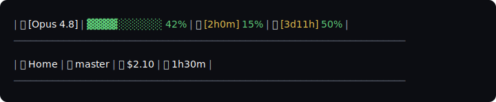

# Claude Code Statusline Kit

[](https://github.com/dberardi2020/claude-statusline-kit/actions/workflows/tests.yml)


A two-line [Claude Code](https://claude.com/claude-code) statusline — **model · context ·
rate-limits**, then **cwd · branch · cost · elapsed** — bracketed by rules. One statusline
in two shells: **bash** for macOS/Linux, **PowerShell** for Windows. Each script is
self-installing, so setup is one download and one command.



It surfaces at a glance what Claude Code otherwise leaves implicit: which model you're on,
how full the context window is, how close each rate-limit window is to resetting, and the
session's directory, branch, and cost. Percentages are color-coded
(**green ≤60 · yellow ≤85 · red >85**); the rate-limit **countdowns** are color-coded by how
much of the window is left (**>60% left → red · 20–60% → yellow · <20% → green**); the
session-elapsed time and all labels stay white.

## Install

Claude Code streams a JSON blob describing the session to your `statusLine` command on
stdin; the script reads it and prints the two lines above. Each script is **self-installing**:
run it with `--install` and it copies itself into `~/.claude/` and merges a `statusLine`
entry into `~/.claude/settings.json` — **backing the file up first and preserving your other
settings**. One download, one command.

### macOS / Linux (bash)

Requires [`jq`](https://jqlang.github.io/jq/).

```bash
curl -fsSLO https://raw.githubusercontent.com/dberardi2020/claude-statusline-kit/main/statusline-command.sh
bash statusline-command.sh --install
```

### Windows (PowerShell)

```powershell
irm https://raw.githubusercontent.com/dberardi2020/claude-statusline-kit/main/statusline.ps1 -OutFile statusline.ps1
./statusline.ps1 -Install
```

Restart Claude Code (or open a new session) and the statusline appears. To undo, restore the
`settings.json.bak-*` file the installer wrote next to your settings.

### Hand it to your coding agent

Already inside Claude Code (or Cursor, or any coding agent)? Paste this and it will do the
install for you:

```text
Install the Claude Code Statusline Kit for my platform from
https://github.com/dberardi2020/claude-statusline-kit

- macOS/Linux: download
  https://raw.githubusercontent.com/dberardi2020/claude-statusline-kit/main/statusline-command.sh
  then run `bash statusline-command.sh --install` (it requires `jq`).
- Windows: download
  https://raw.githubusercontent.com/dberardi2020/claude-statusline-kit/main/statusline.ps1
  then run `./statusline.ps1 -Install`.

The installer copies the script into ~/.claude and merges a `statusLine` entry into
~/.claude/settings.json, backing that file up first and leaving my other settings intact.
When it finishes, tell me to restart Claude Code.
```

### Manual

Prefer to wire it yourself? Copy the script into `~/.claude/`, then add to
`~/.claude/settings.json`:

```json
{
  "statusLine": {
    "type": "command",
    "command": "~/.claude/statusline-command.sh"
  }
}
```

On Windows, point it at PowerShell instead:

```json
{
  "statusLine": {
    "type": "command",
    "command": "pwsh -NoProfile -ExecutionPolicy Bypass -File C:\\path\\to\\statusline.ps1"
  }
}
```

## What each segment shows

| # | Segment | Source field(s) | Format & color |
|---|---------|-----------------|----------------|
| 1 | 🤖 Model | `model.display_name` | Bracketed name, `(1M context)` annotation stripped; white. |
| 2·3 | Context bar + % | `context_window.used_percentage` | 10-cell `▓`/`░` bar + percent. green ≤60 · yellow ≤85 · red >85. |
| 4 | ⏳ 5-hour limit | `rate_limits.five_hour.resets_at` · `.used_percentage` | `[Hh Mm] pct%` — countdown colored by time left (>60% window left → red · 20–60% → yellow · <20% → green), percent colored by usage. |
| 5 | 📅 7-day limit | `rate_limits.seven_day.resets_at` · `.used_percentage` | `[Dd Hh] pct%`. |
| 6 | 📁 Directory | `workspace.current_dir` / `cwd` | Leaf of the working directory; white. |
| 7 | 🌿 Branch | `.git/HEAD` of the cwd (walked up) | Current branch, or `---` when not a repo. |
| 8 | 💰 Cost | `cost.total_cost_usd` | Session cost, `$`F2. |
| 9 | ⏱️ Elapsed | `cost.total_duration_ms` | Wall-clock → `Hh Mm` (drops the hour under 1h). |

Line 1 is model, context bar, context %, and the two rate-limit windows; line 2 is the fixed
context row. The layout is two pipe-delimited lines wrapped in `─`×71 rules.

## Behavior

- **Safe field access** — every value is read through a guarded helper (`Get-Safe` in
  PowerShell, `is_set` + `jq //` defaults in bash), so a missing key degrades the line
  instead of erroring.
- **Graceful segments** — when the rate-limit fields are absent, those segments drop out and
  line 1 is just model + context.
- **Rate-limit countdowns** — `resets_at` (unix seconds) minus now, floored at 0, split into
  d/h/m, and colored by the fraction of the window (5h / 7d) still remaining — the inverse of
  the percentage's coloring, so a window that just reset reads calm and one with lots of time
  left reads hot.
- **Cross-platform parity** — both implementations read the same JSON schema and produce the
  same layout.
- **Safe install** — `--install` backs up `settings.json` before editing and merges rather
  than overwrites, so your existing keys are preserved. If you already have a different
  `statusLine` configured, it's replaced (never silently) — the installer prints a warning
  with the previous command and the backup path so you can restore it.

## Roadmap

Today the kit ships one layout in two shells. Where it's headed:

- **A style catalogue** — additional layouts and segment sets.
- **A builder / wizard** — pick your segments and layout, generate the script. The
  self-install path here is the seed: its safe `settings.json` merge is exactly what the
  builder will reuse.

## Documentation

Full docs live in [`docs/`](docs/README.md):

- **[Product](docs/product/README.md)** — what it shows and how to install it, no code assumed.
- **[Technical](docs/technical/README.md)** — the rendering spec, the two implementations, install, testing.
- **[Decisions](docs/decisions/README.md)** — the architecture decision records (*why* it's built this way).

The styled one-page reference is [`docs/statusline.html`](docs/statusline.html) — the same content in browsable form.

## License

[MIT](LICENSE) © Dimitri Berardi
